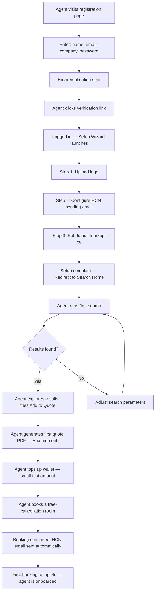
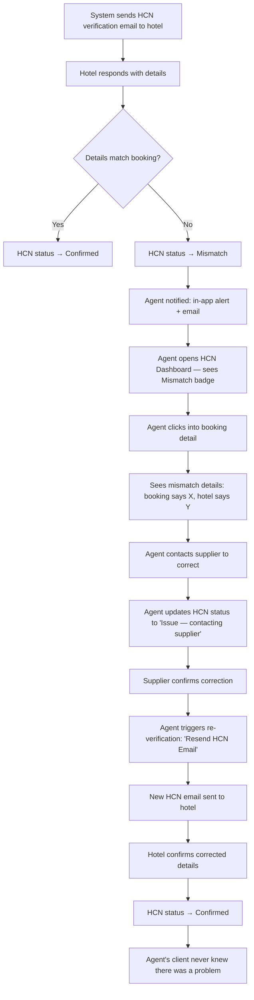

# UX Design Specification Apolles

**Author:** Moshe
**Date:** 2026-03-10

---

<!-- UX design content will be appended sequentially through collaborative workflow steps -->

## Executive Summary

### Project Vision

Apolles is a B2B hotel booking platform that replaces the fragmented multi-portal workflow travel agents endure today with a single system for searching, comparing, quoting, booking, and verifying hotel reservations across multiple suppliers. The platform aggregates hotel inventory from Expedia Rapid and TBO Holidays (MVP), presents Vervotech-powered deduplicated results, and provides workflow tools no competitor offers: a multi-city quote/itinerary PDF builder and automated HCN verification. The UX must serve as both a competitive differentiator (modern, fast, intuitive vs. dated competitor portals) and a productivity multiplier (agents respond to clients in minutes, not hours).

### Target Users

**Primary (MVP): Yael — Freelance Travel Agent**
- One-person operation, 2-10 bookings/day
- Constantly juggles multiple client requests simultaneously
- Responds to client inquiries within minutes — speed is competitive advantage
- Works primarily at a desk (desktop/laptop), occasionally checks from mobile
- Intermediate tech-savviness — expects intuitive, modern tools
- Quote PDF quality is a direct reflection of her professionalism to clients

**Secondary (Fast-Follow): David — Agency Owner**
- Manages 3-15 agents, needs operational oversight
- Controls permissions, margins, and team activity
- Dashboard-oriented: wants single-glance visibility into agency performance

**Secondary (Fast-Follow): Noa — Sub Agent**
- Works within permission boundaries set by agency owner
- Needs an efficient, uncluttered workflow within her authorized scope

**Indirect: End Client (Traveler)**
- Never interacts with Apolles directly
- Experiences the platform through quote PDFs and hotel vouchers
- These documents represent the agent's brand — quality matters

**Admin: Moshe — Platform Operator**
- Monitors API health, hotel mapping accuracy, and support escalations
- Intervenes on failed auto-cancellations and supplier issues

### Key Design Challenges

1. **Multi-client, multi-task workspace**: Agents juggle multiple client requests simultaneously with minutes-level response pressure. The UX must support rapid context-switching with persistent state across multiple in-progress searches and quotes — not a single-task linear flow.

2. **Complex information density with speed requirements**: Search results contain rooms from multiple suppliers with different cancellation policies, meal plans, bed types, and prices. The UX needs progressive disclosure — fast scanning for comparison, deep detail on demand — to balance information richness with speed.

3. **High-stakes, irreversible actions**: Non-refundable bookings charge the wallet, auto-cancellation has financial consequences, voucher generation is a commitment signal. Critical moments must be unmistakably clear without creating friction on routine low-stakes actions.

4. **Ambient wallet awareness**: Wallet balance affects what agents can book. Status must be visible when relevant (flagging rates requiring credit the agent lacks) without obstructing the primary workflow.

5. **Quote builder as a session-spanning, multi-search workflow**: Building a quote requires multiple searches across different cities, hotel selections, and customization. The workflow must survive interruptions (urgent client requests) and allow agents to park quotes, switch context, and return.

6. **HCN verification as background monitoring**: HCN status is critical but secondary to the booking/quoting workflow. It must surface problems (mismatches, failures) proactively without cluttering the main workspace.

### Design Opportunities

1. **Speed as a UX feature**: Progressive loading (first results in 2 seconds), minimal clicks from search to "Add to Quote," and keyboard shortcuts for power users can make the search-to-quote flow feel dramatically faster than any competitor portal.

2. **Quote PDF as a brand differentiator**: Professional, agent-branded templates that make agents' businesses look premium. This is the artifact clients see — it represents the agent's professionalism and is described as "very important" to competitive positioning.

3. **Dashboard as command center**: A mission-control view showing in-progress quotes, bookings needing vouchers, HCN alerts, and auto-cancel countdowns — giving agents a single-glance understanding of their entire workload across all clients.

4. **Smart defaults and memory**: Recent searches, default markup, preferred settings — reducing repetitive input for agents who make similar searches daily.

## Core User Experience

### Defining Experience

The core experience of Apolles is defined by two primary loops:

**Primary Loop — Search to Quote (high frequency, speed-critical):**
Client request arrives → Agent searches (one search, all suppliers) → Agent scans and selects hotel options → Agent adds to quote (one click per hotel) → Agent generates branded PDF → Agent sends to client

This loop happens dozens of times daily. The target is under 5 minutes from client request to quote sent — replacing a 30+ minute manual process. This is the "aha moment" and the reason agents adopt Apolles.

**Secondary Loop — Booking to Delivery (per-booking, sequential):**
Agent books selected hotel → Booking confirmed → Agent generates voucher (commitment signal, stops auto-cancel timer) → Agent sends voucher to client → HCN verification email sent automatically → Agent monitors HCN status over following days (hotel response time varies)

The voucher is the immediate client-facing deliverable after booking. HCN verification is an asynchronous background process that can take hours to days, depending on hotel responsiveness.

### Platform Strategy

- **Platform**: Web application (desktop-first, responsive for occasional mobile check-ins)
- **Primary input**: Mouse/keyboard (desktop power-user workflow)
- **Connectivity**: Strictly online — real-time supplier API data, no offline mode
- **Browser**: Modern browsers (Chrome, Edge, Safari, Firefox)
- **Language**: English only for MVP
- **RTL**: Not required at launch

### Effortless Interactions

**Must be effortless (zero cognitive load):**
- Adding hotels to a quote from search results — single click, no modal, no confirmation
- Switching between in-progress quotes/searches for different clients
- HCN verification — fully automated background process, agent never initiates unless re-sending
- Generating a quote PDF — one click with sensible defaults, preview, send

**Must be clear but not burdensome:**
- Booking flow — clear display of cancellation policy, price breakdown, wallet impact, but streamlined steps
- Voucher generation — clear commitment signal without friction for routine bookings

**Must be deliberate and unmistakable:**
- Non-refundable booking confirmation — wallet charge is irreversible, requires explicit confirmation
- Booking cancellation — penalty display with confirmation gate
- Auto-cancellation override — agent explicitly vouchers to prevent auto-cancel

### Critical Success Moments

1. **First quote PDF generated** (Aha moment): The first time an agent builds a multi-city quote and sees the professional branded PDF. This is when they know Apolles is different. If this moment fails (ugly PDF, slow generation, confusing builder), the agent may never return.

2. **First search results** (Proof of concept): Seeing deduplicated results from multiple suppliers in under 5 seconds, with rate comparison. Proves the aggregation value proposition instantly.

3. **First HCN mismatch caught** (Trust-building): When the HCN system flags a reservation mismatch the agent would have missed. This is when agents become evangelists — they tell every agent they know.

4. **Booking flow completion** (Confidence): Agent completes a booking without confusion about pricing, penalties, or wallet impact. The flow communicates clearly what will happen at every step.

### Experience Principles

1. **Speed-to-Quote is everything**: The defining metric is how fast an agent goes from client request to professional quote PDF. Every UX decision in the search/quote flow must optimize for fewer clicks, faster scanning, and instant actions. If a feature adds a step, it must justify itself.

2. **One-click accumulation**: Adding hotels to a quote from search results is a single, frictionless action. The agent is mentally "shopping" across searches — the UX feels like dropping items into a basket, not filling out forms.

3. **Background intelligence, foreground simplicity**: HCN verification, auto-cancellation warnings, and wallet status work in the background. The foreground experience stays clean and focused on the active task. Background systems surface alerts only when they need attention.

4. **The quote PDF is the product the client sees**: The branded quote is the single most visible output of the platform. It must look professional enough that agents are proud to send it. This is where Apolles becomes the agent's brand partner.

5. **Real-time confidence**: All data is live from supplier APIs. The UX communicates freshness and handles price volatility gracefully — clear messaging without creating anxiety about rate changes.

## Desired Emotional Response

### Primary Emotional Goals

**Core Emotion: Efficient and Powerful**
Agents should feel like Apolles amplifies their capability — the same work that takes 30 minutes on competitor portals takes 5 minutes here. The tool is a professional superpower that makes them faster and more productive.

**Viral Emotion: Professional Pride**
The word-of-mouth trigger is "my quotes look amazing now." Agents are proud of the output they send to clients. The quote PDF elevates their professional image and their business brand. This emotion drives organic adoption among agent networks.

**Error Emotion: Informed and Guided**
When something goes wrong (supplier timeout, HCN mismatch, price change), the agent should feel informed — "I know exactly what happened" — and guided — "I know exactly what to do next." Every error state must have a clear explanation and a specific next action. No dead ends.

### Emotional Journey Mapping

| Stage | Target Emotion | Anti-Pattern to Avoid |
|-------|---------------|----------------------|
| First discovery / registration | Curious, optimistic — "this looks like what I've been wanting" | Overwhelmed by features or lengthy onboarding |
| First search results | Impressed, validated — "this actually works, and it's fast" | Skeptical about rate accuracy or mapping quality |
| First quote PDF generated | Proud, delighted — "this makes my business look premium" | Disappointed by generic or ugly output |
| Core daily workflow | Efficient, powerful, in flow — "I'm getting more done" | Frustrated by extra steps or slow interactions |
| Booking confirmation | Confident, accomplished — "I know exactly what I just committed to" | Anxious about charges, penalties, or unclear terms |
| Supplier timeout / error | Informed, guided — "I know what happened and what to do" | Confused by vague errors or stuck with no next action |
| HCN mismatch caught | Relieved, grateful — "the system saved me from a disaster" | Stressed by the mismatch without clear resolution path |
| Auto-cancel countdown | Aware, unhurried — "I see the deadline and I'm in control" | Panicked by sudden warnings or unclear consequences |
| Returning next day | Comfortable, ready — "everything's where I left it" | Disoriented by lost state or changed layout |

### Micro-Emotions

**Most Critical: Confidence vs. Confusion**
The agent must always know where they are, what will happen next, and what the consequences are. Confidence is the foundational emotional state — without it, every other positive emotion collapses. This is especially critical during:
- Booking flow (pricing, refundability, wallet impact)
- Auto-cancellation countdowns (time remaining, consequences)
- Wallet status (booking eligibility)
- HCN verification (current status, what it means)

**Supporting: Accomplishment vs. Frustration**
Completing key tasks (quote sent, booking confirmed, voucher generated) should feel like micro-accomplishments. Subtle positive feedback — a confirmation animation, a clear success state — reinforces the "efficient and powerful" core emotion.

**Trust vs. Skepticism**
Agents must trust the data: that mapping is accurate (same hotel across suppliers), that pricing is current, that HCN status reflects reality. Trust is built through transparency (showing data freshness, mapping confidence) and consistency (system behaves predictably).

### Design Implications

| Emotional Goal | UX Design Approach |
|---------------|-------------------|
| Efficient and powerful | Minimal clicks, fast transitions, keyboard shortcuts, progressive loading, no unnecessary confirmations on routine actions |
| Professional pride | Premium quote PDF templates, clean typography, agent branding prominently displayed, high-quality hotel imagery |
| Informed and guided | Every error state includes: what happened (plain language), what it means (impact), what to do next (specific action button). No generic error messages. |
| Confidence over confusion | Clear state indicators everywhere (booking status, wallet balance, HCN status), explicit consequences before irreversible actions, consistent visual language for status states |
| Trust in data | Show data freshness ("rates as of 2 min ago"), mapping confidence indicators for platform admin, consistent pricing display, transparent cancellation policies |
| Accomplishment on completion | Subtle positive feedback on task completion (quote sent, booking confirmed), clear success states, progress indicators during multi-step flows |

### Emotional Design Principles

1. **Confidence first**: Every screen answers "where am I?", "what can I do?", and "what will happen if I do it?" without the agent having to think. Status, consequences, and next actions are always visible.

2. **Speed feels powerful**: Fast load times, instant interactions, and progressive disclosure create the feeling of a tool that keeps up with the agent's pace. Latency is the enemy of the "powerful" emotion.

3. **Pride in output**: The quote PDF and voucher are emotional touchpoints — they represent the agent's brand to their clients. These documents must feel premium, not utilitarian.

4. **Graceful degradation, not failure**: When suppliers time out or errors occur, the system degrades gracefully with clear messaging. The agent never feels abandoned or confused. "One supplier is slow" is different from "something broke."

5. **Calm urgency**: Auto-cancellation warnings and HCN mismatches need attention, but should create awareness, not panic. Use progressive escalation (information → reminder → urgent) rather than sudden alarms.

## UX Pattern Analysis & Inspiration

### Inspiring Products Analysis

**Figma / Notion — Modern SaaS Workspace Tools**
- Clean, uncluttered interfaces with generous whitespace despite being feature-rich
- Contextual tooling that appears when needed and hides when not
- Real-time, responsive feel — everything is instant
- Keyboard-first power-user support alongside beginner-friendly interfaces
- Workspace model: multiple projects coexist, easy context switching
- Progressive disclosure: simple surface, depth on demand
- **Relevance**: Workspace model for multi-client juggling, contextual tools, keyboard shortcuts

**Stripe Dashboard — Financial Data Done Right**
- Data density without overwhelm: clean tables, clear hierarchy, status-coded color system
- Consistent visual language for states (succeeded, pending, failed)
- Transaction detail views with click-to-expand and clear audit trails
- Error handling: every failure has a reason and suggested next action
- Financial precision: numbers always exact, well-formatted, unambiguous
- **Relevance**: Booking management, wallet transactions, HCN dashboard, auto-cancel tracking

**Arbitrip — Best B2B Hotel Platform UX (Current Bar)**
- Cleaner search interface than legacy platforms (Hotelbeds, TBO, RateHawk)
- Better visual hotel cards with scannable key information
- More modern visual design than B2B competitors
- Still lacks: multi-supplier aggregation, quote module, HCN automation
- **Relevance**: The UX quality bar in the B2B hotel space — Apolles must exceed this

### Transferable UX Patterns

| Pattern | Source | Apolles Application |
|---------|--------|-------------------|
| Workspace with tabs/panels | Figma/Notion | Multiple in-progress quotes and searches, tab-based context switching between clients |
| Contextual actions on hover/selection | Figma | "Add to Quote" on hotel cards, quick actions on booking rows |
| Keyboard shortcuts for power users | Figma/Notion | Search, add-to-quote, navigate results — keyboard accessible |
| Clean data tables with status badges | Stripe | Booking list, transaction history, HCN dashboard |
| Consistent status color system | Stripe | Booking status, HCN status, wallet status — unified color language |
| Click-to-expand detail views | Stripe | Room details, booking details, transaction details |
| Error states with guided next actions | Stripe | Supplier timeout, booking failure, HCN mismatch resolution |
| Progressive loading / skeleton screens | All three | Search results loading progressively as suppliers respond |
| Clean hotel cards with scannable info | Arbitrip (improved) | Hotel cards with price, stars, amenities, cancellation, supplier comparison |

### Anti-Patterns to Avoid

| Anti-Pattern | Why to Avoid |
|-------------|-------------|
| Cluttered, information-overloaded search results | Agents can't scan quickly — violates speed-to-quote principle |
| Tiny text, dense forms, dated styling | Creates "cheap tool" feeling — violates professional pride emotion |
| Modal confirmation on every action | Slows agents down on routine tasks — violates efficiency principle |
| Hidden or ambiguous cancellation policies | Creates booking anxiety — violates confidence-first emotion |
| Full-page loading between workflow steps | Breaks flow state — violates "efficient and powerful" emotion |
| Generic error messages ("Something went wrong") | Violates "informed and guided" principle — no next action for agent |
| Single-task linear flows without state persistence | Breaks multi-client juggling — forces agents to start over when switching context |

### Design Inspiration Strategy

**Adopt Directly:**
- Figma's workspace/tab model for multi-client context switching
- Stripe's status badge system and consistent color language for all status indicators
- Stripe's error handling pattern (clear reason + specific next action) for all error states
- Progressive loading with skeleton screens for search results

**Adapt for Apolles:**
- Arbitrip's hotel card design — enhance with multi-supplier rate comparison, one-click quote addition, and wallet eligibility indicator
- Notion's generous whitespace approach — balance with travel data density (more info per screen, but cleaner than legacy portals)
- Stripe's transaction detail pattern — adapt for booking detail with HCN status, voucher status, auto-cancel countdown

**Avoid Completely:**
- Legacy B2B hotel portal aesthetics (Hotelbeds, TBO, RateHawk visual style)
- Modal-heavy confirmation patterns on routine actions
- Full-page loads between workflow steps
- Generic or unhelpful error messages without guided next actions

## Design System Foundation

### Design System Choice

**Selected: shadcn/ui + Tailwind CSS** on React (Next.js)

shadcn/ui is a copy-paste component library built on Radix UI primitives with Tailwind CSS styling. Unlike traditional component libraries (MUI, Ant Design), shadcn/ui components are copied into your project — you own the code and have full control to customize every detail without fighting library defaults.

**Core stack:**
- **shadcn/ui**: UI components (buttons, forms, tables, dialogs, badges, tabs, command palette, etc.)
- **Radix UI**: Accessible, composable headless primitives (underlying shadcn/ui)
- **Tailwind CSS**: Utility-first CSS framework for consistent styling
- **React / Next.js**: Application framework

### Rationale for Selection

1. **Aesthetic match**: shadcn/ui's default aesthetic is very close to Stripe and Notion — clean, minimal, professional typography, generous whitespace. Minimal customization needed to achieve the target feel.

2. **Code ownership**: Components are copied into the project, not imported as a dependency. Full control to customize any component without fighting library opinions or waiting for upstream changes.

3. **Accessibility built-in**: Radix UI primitives provide WCAG-compliant keyboard navigation, focus management, screen reader support, and ARIA attributes out of the box.

4. **Development velocity**: Tailwind CSS enables rapid UI development with consistent design tokens (spacing, colors, typography). shadcn/ui components are production-ready and well-documented.

5. **Component coverage**: The library covers all critical Apolles UI needs:
   - Data tables (with react-table integration) for bookings, transactions, HCN dashboard
   - Tabs for workspace model / multi-client context switching
   - Status badges for booking status, HCN status, wallet indicators
   - Command palette for keyboard shortcuts / power-user navigation
   - Forms for search, booking, profile settings
   - Dialogs for confirmations on irreversible actions
   - Toast notifications for background alerts (HCN, auto-cancel)

6. **Ecosystem**: React/Next.js has the largest developer ecosystem and strongest support for shadcn/ui, Tailwind, and related tooling.

### Visual Identity Direction

The overall design style must feel **clean, modern, and highly polished**, similar to Stripe or Notion. A professional SaaS aesthetic with:

- **Minimal clutter**: Every element on screen earns its place. Remove before adding.
- **Strong typography**: Clear type hierarchy with a modern sans-serif (Inter or equivalent). Headlines, body, and metadata are immediately distinguishable by weight and size.
- **Generous whitespace**: Breathing room between elements. Content doesn't feel cramped or dense, even when displaying complex hotel data.
- **Clear visual hierarchy**: The most important information (price, hotel name, status) is immediately scannable. Supporting details are visually subordinate.
- **Innovative and premium feel**: The interface should feel like a tool built by a world-class team — not a generic admin panel. Soft details, refined spacing, and sleek layouts.
- **Trustworthy and credible**: Financial data, booking status, and pricing must feel precise and reliable. No ambiguity in numbers or states.
- **Soft details**: Subtle shadows, gentle border radius, refined transitions. Nothing harsh, nothing heavy.

### Implementation Approach

**Phase 1 — Foundation setup:**
- Initialize shadcn/ui with Tailwind CSS in the Next.js project
- Define design tokens (colors, typography, spacing, border radius) aligned with visual identity
- Set up consistent status color system (from Stripe-inspired patterns)
- Create base layout components (sidebar navigation, workspace tabs, page shells)

**Phase 2 — Core component customization:**
- Customize hotel card component (not in shadcn/ui — custom build on top of Card primitive)
- Customize data table for booking list, transaction history (shadcn/ui table + react-table)
- Build quote builder workspace components (tab management, hotel selection)
- Design status badge system with consistent color coding

**Phase 3 — Specialized components:**
- PDF preview/builder interface
- Search results with progressive loading states
- HCN status dashboard with timeline view
- Wallet balance indicators and transaction detail views

### Customization Strategy

**Design Tokens to Define:**

| Token Category | Purpose | Direction |
|---------------|---------|-----------|
| Colors — Primary | Brand identity, primary actions | A refined, confident primary color (deep blue or similar). Subtle hover states. No harsh saturated colors. |
| Colors — Status | Consistent status communication | Green (confirmed/success), Amber (pending/warning), Red (alert/mismatch/error), Gray (inactive/disabled). Muted tones, not screaming. |
| Colors — Neutral | Backgrounds, borders, text | Off-whites and light grays for backgrounds. Clear contrast for text. Stripe-like subtlety. |
| Colors — Accent | Highlights, interactive elements | Used sparingly for emphasis — price highlights, wallet indicators, quote builder selection |
| Typography | Clean, professional readability | Inter (or equivalent modern sans-serif). Clear size hierarchy: 14px body, 12px metadata, 18-24px headings. Medium weight for emphasis, regular for body. |
| Spacing | Generous, consistent rhythm | 4px base unit. 16-24px between sections. 8-12px within components. Feels spacious, not cramped. |
| Border radius | Modern, softened feel | 6-8px for cards and containers. 4px for inputs and buttons. Consistent across all components. |
| Shadows | Subtle depth and elevation | Very subtle drop shadows for cards (1-2px offset, low opacity). Slightly more defined for dropdowns and modals. Never heavy. |
| Transitions | Smooth, refined interactions | 150-200ms ease transitions. Subtle fade-ins for loading states. No jarring state changes. |

**Custom Components Needed (not in shadcn/ui):**
- Hotel result card (search results) — with rate comparison, one-click quote action
- Rate comparison row (multi-supplier pricing within a hotel card)
- Quote builder workspace (multi-city, hotel selection, drag/drop ordering)
- HCN status timeline (per-booking verification history)
- Auto-cancel countdown indicator (progressive urgency visualization)
- Wallet balance widget (header-level, ambient awareness)
- PDF preview pane (quote and voucher preview before generation)

## Defining Core Experience

### Defining Experience

**"One place for everything."**

Apolles' defining experience is the unification itself — that everything a travel agent needs to serve their clients lives in a single, cohesive workspace. Search, compare, quote, book, verify, manage — all in one tool, replacing the fragmented multi-portal workflow. The agent opens Apolles in the morning and doesn't need another tool for hotel bookings.

The interaction agents will describe to colleagues: "I search all my suppliers at once, build beautiful quotes in minutes, book with a click, and the system verifies my reservations automatically. It's all in one place."

### User Mental Model

**Current mental model (fragmented):**
- Each supplier portal = a separate tool with its own login, UI, and quirks
- Quote creation = manual Word/Excel document assembly
- HCN verification = manual email process easily forgotten
- Booking tracking = spreadsheets or memory
- The agent is the integration layer — holding everything together in their head

**Apolles mental model (unified workspace):**
- One platform = one login, one workflow, one interface
- Context-switching happens between clients (tabs), not between tools
- Quote creation = integrated workflow from search results to PDF
- HCN verification = automated background system with dashboard
- Booking tracking = built-in management with status indicators
- The platform is the integration layer — the agent focuses on serving clients

**Key mental model shift**: Agents are accustomed to context-switching between tools. Apolles replaces that with context-switching between clients within one tool. The workspace model (tabs/panels) supports this — each tab represents a client's context, not a different tool.

### Success Criteria

The "one place for everything" experience succeeds when:

1. **Agents stop opening other portals**: Apolles becomes the first (and only) tool opened each morning for hotel bookings. Success = daily login as primary tool.
2. **Quote generation in under 5 minutes**: Multi-city, multi-hotel quote PDF sent to client within 5 minutes of starting the search — replacing 30+ minutes of manual work.
3. **Zero missed HCN verifications**: Every booking gets verified automatically. The agent doesn't need to remember to check.
4. **Seamless client switching**: Agent can switch between Client A's Santorini search and Client B's Barcelona quote without losing state or context.
5. **"This just works" feeling**: Agent completes a search → quote → book → verify cycle without confusion, without wondering "what do I do next?", without leaving Apolles.

### Novel UX Patterns

| Aspect | Pattern Type | Approach |
|--------|-------------|----------|
| Hotel search form | Established | Familiar search fields (destination, dates, rooms). No learning curve. |
| Multi-supplier deduplicated results | Novel combination | Familiar hotel cards, novel rate comparison across hidden suppliers. Requires clear visual design to show "same hotel, different rates." |
| One-click add-to-quote | Established adaptation | "Add to cart" interaction — universally understood. Adapted for quote context. |
| Quote builder (multi-city) | Novel for domain | No B2B competitor has this. Interaction maps to familiar patterns: select → organize → preview → generate. |
| Workspace tabs for multi-client | Established | Browser/Figma tab pattern. Agents already use multiple browser tabs — this formalizes it. |
| HCN dashboard | Novel for domain | Agents have never had automated verification. Maps to "notification center" pattern — familiar UI for a new capability. |
| Auto-cancel countdown | Novel for domain | Progressive urgency visualization. No direct precedent in B2B hotel — adapts from countdown/deadline patterns in project management tools. |
| Wallet-gated booking | Established adaptation | E-commerce "insufficient balance" pattern. Clear eligibility indicators on search results prevent frustration at checkout. |

### Experience Mechanics

**1. Initiation — Agent opens Apolles:**
- Dashboard as command center: in-progress quotes, recent bookings needing vouchers, HCN alerts, auto-cancel warnings
- Single-glance workload overview — agent knows immediately what needs attention
- "New Search" button prominently placed for starting fresh client requests
- Existing in-progress quotes accessible as tabs or from dashboard

**2. Core Interaction — Search, Select, Quote:**
- Search: familiar form (destination, dates, rooms, guests). Type destination → autocomplete. Select dates → search.
- Results: progressive loading (skeleton → first supplier results in 2s → second supplier appended). Hotel cards with: name, star rating, price (cheapest highlighted), cancellation summary, "Add to Quote" button.
- Selection: one click "Add to Quote" → hotel added. Toast confirms. Quote counter in sidebar/header updates. No page navigation. No modal. No confirmation dialog.
- Multi-city: agent searches next city (new search within same quote context or new tab). Adds more hotels. Quote accumulates selections across cities.
- Quote builder: view all selected hotels organized by city. Reorder, add notes, preview PDF layout. One click to generate.

**3. Feedback — How the agent knows it's working:**
- Progressive loading skeleton → results appearing = "it's actively searching suppliers"
- "Added to Quote" toast + counter update = "my selection is saved, I can keep going"
- PDF preview = "I see exactly what my client will see — I'm in control"
- Booking confirmation with reference number + voucher ready = "it's done, it's real"
- HCN status badge on booking = "verification is being handled"

**4. Completion — Output delivered:**
- Quote PDF generated and sent → success state ("Quote sent to client@email.com")
- Booking confirmed → voucher generated → sent to client → booking card shows "Vouchered" status
- HCN verification runs in background → booking card updates status over following days
- Agent's workspace for this client persists — they can return anytime to check status or create new quotes

## Visual Design Foundation

### Color System

**Primary Palette (Stripe-inspired, distinctly Apolles):**

| Token | Value | Usage |
|-------|-------|-------|
| `--primary` | `#635BFF` | Primary actions (buttons, links, active states). Apolles brand color. |
| `--primary-hover` | `#5046E5` | Hover state for primary elements |
| `--primary-light` | `#EEF0FF` | Primary tinted backgrounds (selected states, highlights) |
| `--dark` | `#0A2540` | Sidebar navigation, dark UI areas, high-contrast sections |
| `--dark-secondary` | `#1A3A5C` | Secondary dark elements, dark hover states |
| `--accent` | `#00D4FF` | Secondary accent — used sparingly for highlights, price callouts, special indicators |

**Neutral Palette:**

| Token | Value | Usage |
|-------|-------|-------|
| `--surface` | `#F6F9FC` | Page background — cool blue-tinted off-white |
| `--card` | `#FFFFFF` | Card backgrounds, content containers |
| `--border` | `#D6E3F0` | Borders, dividers — blue-tinted for cohesion |
| `--border-subtle` | `#E8EDF4` | Subtle borders, inner dividers |
| `--text-primary` | `#1F2937` | Primary text — dark blue-gray |
| `--text-secondary` | `#6B7280` | Secondary text, metadata, labels |
| `--text-muted` | `#9CA3AF` | Disabled text, placeholder text |

**Status Colors (Muted, professional tones — not screaming):**

| Token | Value | Usage |
|-------|-------|-------|
| `--success` | `#059669` | Confirmed, verified, completed. HCN confirmed, booking vouchered. |
| `--success-bg` | `#ECFDF5` | Success background tint |
| `--warning` | `#D97706` | Pending, waiting, attention needed. HCN waiting, approaching deadline. |
| `--warning-bg` | `#FFFBEB` | Warning background tint |
| `--error` | `#DC2626` | Error, mismatch, failed. HCN mismatch, booking failed, auto-cancel imminent. |
| `--error-bg` | `#FEF2F2` | Error background tint |
| `--info` | `#2563EB` | Informational states, email sent. |
| `--info-bg` | `#EFF6FF` | Info background tint |
| `--neutral` | `#6B7280` | Inactive, disabled, archived. |
| `--neutral-bg` | `#F3F4F6` | Neutral background tint |

**Status Color Application (Apolles-specific):**

| Status | Color Token | Examples |
|--------|------------|---------|
| Booking: Confirmed (unvouchered) | `--info` | Blue badge — action available (generate voucher) |
| Booking: Vouchered | `--success` | Green badge — committed, safe |
| Booking: Auto-cancel warning | `--warning` | Amber badge + countdown — needs attention |
| Booking: Cancelled | `--neutral` | Gray badge — final state |
| HCN: Email Sent | `--info` | Blue — in progress |
| HCN: Confirmed | `--success` | Green — verified |
| HCN: Mismatch | `--error` | Red — requires action |
| HCN: Waiting | `--warning` | Amber — pending hotel response |
| Wallet: Sufficient | No indicator | Default — no visual noise |
| Wallet: Insufficient for rate | `--warning` | Amber flag on rate — requires top-up |
| Wallet: Blocked | `--error` | Red — cannot book |

**Color Mode:** Light mode only for MVP. Tailwind CSS and shadcn/ui design token architecture supports future dark mode addition without refactoring.

### Typography System

**Font Family:**

| Role | Font | Fallback |
|------|------|----------|
| Primary (UI) | Inter | system-ui, -apple-system, sans-serif |
| Monospace (codes, numbers) | JetBrains Mono | ui-monospace, monospace |

Inter is chosen for its excellent readability at small sizes, clear distinction between similar characters (1, l, I), wide language support, and free availability. It matches the Stripe/Notion aesthetic directly.

**Type Scale:**

| Level | Size | Weight | Line Height | Usage |
|-------|------|--------|-------------|-------|
| Display | 30px | 700 (Bold) | 1.2 | Page titles ("Hotel Search", "Quote Builder") |
| H1 | 24px | 600 (Semibold) | 1.3 | Section headers |
| H2 | 20px | 600 (Semibold) | 1.3 | Sub-section headers |
| H3 | 16px | 600 (Semibold) | 1.4 | Card titles (hotel name), table headers |
| Body | 14px | 400 (Regular) | 1.5 | Default text, descriptions, form labels |
| Body (emphasis) | 14px | 500 (Medium) | 1.5 | Prices, important values, inline emphasis |
| Small | 13px | 400 (Regular) | 1.4 | Secondary info, metadata, timestamps |
| Caption | 12px | 400 (Regular) | 1.4 | Labels, badges, helper text |
| Micro | 11px | 500 (Medium) | 1.3 | Status badges, counters, tags |

**Typography Principles:**
- Prices always displayed in medium weight (500) for scanability
- Hotel names in semibold (600) — the most scanned element on result cards
- Status text uses the `Micro` scale with matching status color for maximum information density
- Monospace font for booking reference numbers, confirmation codes, and wallet amounts for precision

### Spacing & Layout Foundation

**Spacing Scale (4px base unit):**

| Token | Value | Usage |
|-------|-------|-------|
| `--space-1` | 4px | Tight: between icon and label, badge padding |
| `--space-2` | 8px | Compact: within components, between related items |
| `--space-3` | 12px | Default: between form fields, within cards |
| `--space-4` | 16px | Standard: section padding, between cards |
| `--space-5` | 20px | Comfortable: between distinct groups |
| `--space-6` | 24px | Spacious: between major sections |
| `--space-8` | 32px | Page-level: between page sections |
| `--space-10` | 40px | Large: page margins, major separations |

**Layout Structure:**

- **Sidebar navigation**: Fixed left sidebar (240px collapsed to 64px icon-only). Dark (`--dark`) background. Always visible.
- **Main content area**: Fluid width, responsive. `--surface` background.
- **Content max-width**: 1440px centered within the main area for readable line lengths on wide screens.
- **Card grid**: 12-column CSS grid within content area. Hotel cards: 3-column grid on desktop (4-column on ultrawide). Booking list: full-width table.
- **Page padding**: `--space-6` (24px) on sides, `--space-8` (32px) top.

**Layout Principles:**
1. **Generous whitespace between sections, compact within components**: Cards have breathing room between them, but information within a card is efficiently organized.
2. **Fixed sidebar, fluid content**: Sidebar provides persistent navigation context. Content area adapts to available width.
3. **Tab-based workspace**: Top of content area supports tabs for multi-client context switching (search tabs, quote tabs).
4. **Sticky headers**: Table headers, search filters, and action bars stay visible when scrolling.

### Accessibility Considerations

**Color Contrast:**
- All text meets WCAG 2.1 AA minimum contrast ratios: 4.5:1 for normal text, 3:1 for large text
- `--text-primary` (#1F2937) on `--card` (#FFFFFF): ~13.5:1 contrast ratio (exceeds AAA)
- `--text-secondary` (#6B7280) on `--card` (#FFFFFF): ~5.0:1 contrast ratio (meets AA)
- Status colors chosen to maintain contrast on both white and tinted backgrounds
- Status is never communicated by color alone — always paired with text label or icon

**Keyboard Accessibility:**
- All interactive elements focusable via Tab key
- Visible focus indicators (2px primary color outline with 2px offset)
- Keyboard shortcuts for power-user workflows (search, add-to-quote, navigate)
- Escape key to close modals, dismiss toasts, cancel actions

**Screen Reader Support:**
- Radix UI primitives (via shadcn/ui) provide ARIA attributes and roles automatically
- Dynamic content changes (progressive loading, toast notifications) announced via aria-live regions
- Status changes (HCN status, booking status) communicated via aria-live="polite"

**Motion Preferences:**
- Respect `prefers-reduced-motion` OS setting
- Disable animations and transitions for users who prefer reduced motion
- Skeleton loading states remain static (no shimmer animation) when reduced motion is active

## Design Direction Decision

### Design Directions Explored

6 design directions were generated and explored as interactive HTML mockups (`ux-design-directions.html`):

1. **Classic SaaS Dashboard** — Dark sidebar + card grid (Stripe-like)
2. **Workspace Centric** — Collapsed icon sidebar + tab workspace (Figma-like)
3. **Content-Dense Pro** — Table-driven, maximum data density
4. **Airy Modern** — Top navigation + generous whitespace (Notion-like)
5. **Command-Palette First** — Keyboard-driven with dashboard stats (Linear-like)
6. **Split Panel Workflow** — Master-detail layout (email-client pattern)

### Chosen Direction

**Direction 1: Classic SaaS Dashboard** — selected as the primary layout pattern.

**Key Layout Decisions:**
- **Dark sidebar** (`#0A2540`) with persistent navigation — always visible, provides consistent context
- **Card grid** for search results — hotel cards in a responsive grid (3 columns on desktop)
- **Home page = Search engine** — after login, the agent lands directly on the hotel search page, not a separate dashboard. Search is the primary action and the first thing agents see.
- **Sidebar as workspace context** — wallet balance, in-progress quote indicator, HCN alerts, and navigation all accessible from the sidebar without leaving the current page
- **Clean, flat design** — no gradients anywhere. Solid colors only.

### Color Palette (Confirmed)

| Color | Value | Role |
|-------|-------|------|
| Dark / Sidebar | `#0A2540` | Sidebar background, dark UI areas |
| Primary / Brand | `#635BFF` | Primary actions, buttons, active states, links |
| Accent | `#00D4FF` | Secondary highlights, rate comparison callouts, special indicators |
| Light Accent | `#E6F4FF` | Light blue tint for informational backgrounds, selected states |
| Surface | `#F6F9FC` | Page background, content area |
| Card | `#FFFFFF` | Card backgrounds, content containers |

No gradients. Flat, solid colors throughout. Clean and professional.

### Design Rationale

1. **Search-first home page**: Agents open Apolles to search. Making search the landing page eliminates one click and reinforces the "one place for everything" experience — the tool is ready to work the moment the agent logs in.

2. **Dark sidebar**: Provides strong visual contrast between navigation and content. Creates a professional, premium feel. The dark sidebar with light content area is the proven pattern for data-dense SaaS tools (Stripe, Linear, Vercel). Wallet balance and key alerts live in the sidebar for persistent ambient awareness.

3. **Card grid for results**: Hotel cards in a grid allow agents to scan multiple options quickly. Cards accommodate images, pricing, cancellation badges, and one-click "Add to Quote" actions without feeling cluttered.

4. **No gradients**: Flat, solid colors create a cleaner, more professional appearance. Gradients can feel decorative — the Apolles aesthetic is functional and refined.

### Quote System UX Architecture

**Quote presence in the system — 3 consistent touchpoints + contextual access:**

| Location | Purpose | Agent Action |
|----------|---------|-------------|
| **Settings → Quote Settings Tab** | Template configuration | Select from pre-built PDF templates, customize branding (logo, colors, disclaimer text) |
| **Quotes History Page** | Browse, manage, re-search past quotes | View sent/saved quotes, re-search rooms from a past quote |
| **Search Results Page** | Add hotels to current quote | "Add to Quote" button on hotel cards → select rooms → added to in-progress quote |
| **Room Detail Page** | Add specific room to current quote | "Add to Quote" from room detail view with rate/policy context |

**Quote Flow:**

1. Agent searches hotels (any city/dates)
2. From search results, agent clicks "Add to Quote" on a hotel card
3. Agent selects 1 or more rooms from that hotel (minimum 1 room required)
4. Selected rooms added to the current in-progress quote
5. Agent can continue searching — same city for more options or different city for multi-city quote
6. Agent can view/edit the current quote at any point (sidebar panel or quote builder page)
7. Agent sends quote to client via email **or** downloads as PDF
8. On send or download, the quote is automatically saved to Quotes History
9. Agent can also manually save a draft quote before sending

**Re-Search from Quote History:**

From the Quotes History page, an agent can select a past quote, choose 1 or more rooms from that quote, and trigger a re-search. The system pre-fills: hotel name, check-in/check-out dates, and number of guests from the original search. This enables quick rate refreshes for returning clients or re-quoting after rate changes.

**Quote State Management:**

| State | Description | How It's Created |
|-------|-------------|-----------------|
| In-Progress | Current working quote, not yet sent | Agent adds first hotel/room to a new quote |
| Draft (Saved) | Manually saved but not sent | Agent clicks "Save Draft" |
| Sent | Delivered to client | Agent clicks "Send" (auto-saves) |
| Downloaded | Downloaded as PDF | Agent clicks "Download PDF" (auto-saves) |

**Consistent Quote Indicator:**

A persistent quote widget in the sidebar shows:
- Current quote name/client (editable)
- Number of cities and rooms selected
- "View Quote" shortcut to open the quote builder
- Visual indicator when a quote is in progress (so the agent always knows there's an active quote)

**Quote Settings (Settings → Quote Settings Tab):**

- Pre-built PDF template gallery (3-5 templates at launch)
- Template preview with live data
- Branding customization: logo placement, primary/secondary colors, header/footer text
- Default disclaimer text (editable, max 1000 characters)
- Default markup percentage for new quotes

### Implementation Approach

**Layout Shell (reused across all pages):**
- Fixed dark sidebar (240px) with: brand, navigation items, wallet widget, quote indicator
- Collapsible sidebar (to 64px icon-only) for more content space
- Main content area (fluid width) with `#F6F9FC` background
- Sticky top bar within content area for page title + contextual actions
- Tab bar below top bar for multi-context workspace (search tabs, quote tabs)

**Page Hierarchy:**
1. **Search (Home)** — Search form + results grid. The default landing page after login.
2. **Quote Builder** — Multi-city hotel/room organization, notes, PDF preview, send/download
3. **Quotes History** — All saved/sent quotes with re-search capability
4. **Bookings** — Table view with status badges, filters, search, voucher actions
5. **HCN Dashboard** — Status overview with filters and timeline per booking
6. **Voucher Queue** — Batch voucher management
7. **Wallet** — Balance, top-up, transaction history
8. **Settings** — Profile, branding, Quote Settings tab, HCN email config, notifications

## User Journey Flows

### Journey 0: First-Time Agent Onboarding

**Goal:** New agent registers, configures account, completes first search and first booking within 24 hours.

**Entry Point:** Registration page (linked from marketing site or word-of-mouth referral)



**Flow Details:**

| Step | Page | Agent Action | System Response | Feedback |
|------|------|-------------|-----------------|----------|
| 1 | Registration | Fill form, submit | Validate fields, send verification email | "Check your email for verification link" |
| 2 | Email | Click verification link | Verify email, create account, log in | Redirect to setup wizard |
| 3 | Setup Wizard (3 steps) | Upload logo, set email, set markup | Save each step, show progress (1/3, 2/3, 3/3) | Each step shows preview of how it will appear |
| 4 | Search (Home) | Run first search | Progressive loading → results appear | "47 hotels found from 2 suppliers" |
| 5 | Search Results | Click "Add to Quote" | Hotel added to new quote | Toast: "Added to quote" + sidebar quote counter |
| 6 | Quote Builder | Click "Generate PDF" | PDF generated with agent's branding | PDF preview — aha moment |
| 7 | Wallet | Top up via payment gateway | Payment processed, balance updated | Balance shown in sidebar |
| 8 | Search Results → Book | Click "Book" on a rate | Booking form with guest details | Pre-filled where possible |
| 9 | Booking Form | Enter guest details, confirm | Price check → book with supplier → confirm | Confirmation page with ref number + "HCN email sent" |

**Time Target:** Registration to first booking in under 30 minutes. Setup wizard: under 2 minutes.

---

### Journey 1: Daily Booking Flow (Primary Loop)

**Goal:** Agent receives client request → searches → adds to quote → sends quote → books → generates voucher → HCN verifies.

**Entry Point:** Search page (Home) — agent is already logged in.

```mermaid
flowchart TD
    A[Client sends request via WhatsApp/email] --> B[Agent opens Apolles — lands on Search Home]
    B --> C[Enter destination, dates, rooms, guests]
    C --> D[Click Search]
    D --> E[Progressive loading: skeleton → first results in 2s → more appended]
    E --> F[Agent scans hotel cards — each shows cheapest rate, basis, cxl]
    
    F --> G{Agent wants to quote?}
    G -->|Yes| H[Click 'Add to Quote' on hotel card]
    H --> I[Select rooms — minimum 1]
    I --> J[Toast: 'Added to quote' — sidebar counter updates]
    J --> K{More hotels/cities needed?}
    K -->|Yes — same city| F
    K -->|Yes — different city| C
    K -->|No| L[Open Quote Builder]
    
    G -->|No — wants to book directly| M[Click 'Book' on rate]
    M --> N[Booking form: guest details, payment review]
    
    F --> O{Agent wants more room options?}
    O -->|Yes| P[Click 'More Rooms' — new window with all rooms/rates]
    P --> Q[Agent reviews rooms, selects preferred]
    Q --> G
    
    L --> R[Review quote: hotels by city, notes, preview]
    R --> S{Send or save?}
    S -->|Send| T[Enter client email, send]
    T --> U[Quote auto-saved to Quotes History]
    S -->|Download PDF| V[Download PDF, auto-saved]
    S -->|Save Draft| W[Saved as draft in Quotes History]
    
    U --> X[Client responds with selection]
    X --> M
    
    N --> Y[System: price check with supplier]
    Y --> Z{Price changed?}
    Z -->|No| AA[Display confirmed price, cxl policy, wallet impact]
    Z -->|Yes| AB[Display: 'Price changed from $X to $Y' — confirm or cancel]
    AB --> AA
    AA --> AC[Agent confirms booking]
    AC --> AD{Wallet check for non-refundable}
    AD -->|Sufficient or free-cancel| AE[Booking confirmed — ref number displayed]
    AD -->|Insufficient| AF[Blocked: 'Requires $X wallet credit' — top-up link]
    AE --> AG[Agent generates voucher — booking committed]
    AG --> AH[Agent sends voucher to client]
    AH --> AI[HCN verification email auto-sent to hotel]
    AI --> AJ[Agent monitors HCN status on dashboard over following days]
```



**Hotel Card Interaction Detail:**

| Element | Display | Action |
|---------|---------|--------|
| Hotel image | Flat color or hotel photo | — |
| Hotel name | Semibold, 15px | Click → More Rooms window |
| Star rating | Star icons | — |
| Price | Cheapest rate, bold, 20px | — |
| Meal basis | Badge (e.g., "Breakfast", "Room only") | — |
| Cancellation | Badge (e.g., "Free cancel until Apr 10" or "Non-refundable") | — |
| Wallet flag | Amber indicator if wallet insufficient for this rate | — |
| "Add to Quote" | Primary button | Adds hotel to current in-progress quote (select rooms first) |
| "Book" | Secondary button | Goes directly to booking form for cheapest rate |
| "More Rooms" | Text link | Opens new window/panel with all available rooms and rates |

---

### Journey 2: HCN Mismatch Recovery

**Goal:** Agent discovers an HCN mismatch flagged by the system, investigates, resolves with supplier, and re-verifies.

**Entry Point:** HCN Dashboard or booking detail (triggered by system notification).



**Mismatch Detail View:**

| Element | Display |
|---------|---------|
| Booking reference | `APL-2026-XXXX` (monospace) |
| Hotel name | Hotel name, location |
| Booking details | Check-in/out dates, room type, guest name |
| Mismatch details | Side-by-side comparison: "Your booking says: [X]" vs "Hotel says: [Y]" |
| Status | Red "Mismatch" badge with timestamp |
| Actions | "Update Status" dropdown, "Resend HCN Email" button, "Add Note" |
| Timeline | Chronological: email sent → hotel responded → mismatch detected → agent action |

---

### Journey Patterns (Reusable Across All Flows)

**Navigation Patterns:**
- **Search → Results → Detail**: Progressive drill-down. Each level adds more information without losing the previous context (back button returns to results with scroll position preserved).
- **Sidebar persistence**: Wallet, quote indicator, and HCN alerts remain visible regardless of which page the agent is on. Context is never lost.
- **Tab-based multi-tasking**: Each client's search/quote can exist in a tab. Switching tabs preserves all state.

**Decision Patterns:**
- **Low-stakes action → no confirmation**: "Add to Quote," search, filter, sort — all instant, no modal.
- **Medium-stakes action → inline confirmation**: Voucher generation shows a clear "This commits the booking" message with confirm button.
- **High-stakes action → confirmation gate**: Non-refundable booking and cancellation show full details (price, penalty, consequences) with explicit "Confirm" button.

**Feedback Patterns:**
- **Toast notifications**: For quick confirmations ("Added to quote," "Quote sent," "Voucher generated"). Auto-dismiss after 4 seconds. Non-blocking.
- **Status badges**: For persistent state communication (booking status, HCN status, wallet status). Always visible on relevant cards/rows.
- **Progressive loading**: Skeleton screens during search. First results appear in 2 seconds, more appended as suppliers respond. Never a blank screen.
- **Error with next action**: Every error includes what happened + what to do. "Supplier timeout — results from 1 supplier shown. [Retry]"

### Flow Optimization Principles

1. **Minimize clicks to core value**: Search (1 form + 1 click) → Results (immediate) → Add to Quote (1 click) → Generate PDF (1 click). Total: 4 interactions from search to quote.

2. **No dead ends**: Every screen has a clear next action. Every error state has a resolution path. Every completed task suggests what to do next.

3. **Preserve context on navigation**: Back button returns to exact previous state (scroll position, filters, selections). Tab switching preserves all state. Quote persists across searches.

4. **Progressive commitment**: Low-friction early actions (search, browse, add to quote) build confidence before high-commitment actions (book, pay). The agent builds comfort before spending money.

5. **Ambient awareness, not interruption**: HCN alerts, auto-cancel warnings, and wallet status are visible but don't interrupt the current task. Notifications escalate gradually (info → reminder → urgent) rather than alarming immediately.

## Component Strategy

### Design System Components (shadcn/ui Coverage)

**Available from shadcn/ui (direct use or minor customization):**

| Component | shadcn/ui Name | Apolles Usage |
|-----------|---------------|---------------|
| Button | `Button` | Primary ("Book", "Add to Quote", "Send"), Secondary, Ghost, Destructive variants |
| Input | `Input` | Search fields, booking form fields, settings fields |
| Select | `Select` | Destination picker, room type filter, nationality/residency |
| DatePicker | `Calendar` + `Popover` | Check-in/out date selection |
| Table | `Table` | Bookings list, wallet transactions, quotes history |
| Dialog | `Dialog` | Confirmation gates (non-refundable booking, cancellation) |
| Sheet | `Sheet` | Sidebar quote panel (slide-out from right) |
| Tabs | `Tabs` | Workspace tabs, settings sections, quote builder city tabs |
| Badge | `Badge` | Meal basis, cancellation policy labels |
| Toast | `Toast` (Sonner) | "Added to quote", "Quote sent", "Voucher generated" feedback |
| Tooltip | `Tooltip` | Truncated text, icon-only actions, information hints |
| Dropdown | `DropdownMenu` | Status updates, bulk actions, more actions menus |
| Skeleton | `Skeleton` | Progressive loading states for hotel cards, tables |
| Avatar | `Avatar` | User menu, agency branding |
| Separator | `Separator` | Section dividers |
| ScrollArea | `ScrollArea` | Sidebar navigation, long lists |
| Card | `Card` | Base container for hotel cards, booking cards, quote items |
| Popover | `Popover` | Wallet balance detail, filter panels |
| Command | `Command` | Keyboard-driven search/navigation (future power-user feature) |
| Accordion | `Accordion` | FAQ, expandable booking details, settings sections |
| Progress | `Progress` | Setup wizard progress, file upload |

### Gap Analysis

**Components needed but NOT available in shadcn/ui:**

| Gap | Why Not Available | Priority |
|-----|-------------------|----------|
| HotelResultCard | Domain-specific: multi-supplier rate, quote/book actions, wallet flag | P0 — Core |
| StatusBadge | Enum-driven single component with variant prop for all status states | P0 — Core |
| AutoCancelCountdown | Push-based (WebSocket/SSE) countdown with progressive urgency | P0 — Core |
| WalletWidget | Sidebar-persistent balance indicator with insufficiency warnings | P0 — Core |
| QuoteIndicator | Sidebar-persistent in-progress quote summary | P0 — Core |
| QuoteTemplateSelector | Template gallery with live preview and branding customization | P1 — Quote Flow |
| QuotePDFPreview | Real-time PDF preview with selected template and agent branding | P1 — Quote Flow |
| HCNTimeline | Per-booking verification timeline (sent → response → status) | P1 — HCN Flow |
| RateComparisonTable | Multi-room, multi-supplier rate table for "More Rooms" view | P1 — Detail |
| SearchFormComposite | Multi-room, multi-destination search form with nationality/residency default | P0 — Core |
| VoucherPreview | Booking voucher PDF preview before generation | P2 — Voucher Flow |

### Custom Components

#### HotelResultCard

**Purpose:** Display a single hotel in search results with the cheapest rate, key details, and immediate action buttons. The primary unit of search result interaction.

**Content:**
- Hotel image (or flat color placeholder)
- Hotel name (semibold, clickable → "More Rooms")
- Star rating (1-5 stars as icons)
- Cheapest rate price (bold, prominent)
- Supplier source (hidden from agent — internal only)
- Meal basis badge (e.g., "Breakfast Included", "Room Only")
- Cancellation policy badge (e.g., "Free Cancel until Apr 10", "Non-refundable")
- Wallet insufficiency flag (amber indicator when wallet < rate for non-refundable)

**Actions:**
- **"Add to Quote"** — Primary button. True 1-click: adds the displayed cheapest rate directly to the in-progress quote. No intermediate selection step from the card itself. Toast confirms.
- **"Book"** — Secondary button. Navigates directly to booking form for the cheapest displayed rate.
- **"More Rooms"** — Text link. Opens a new window/panel with all available rooms and rates (RateComparisonTable).

**States:**

| State | Visual Treatment |
|-------|-----------------|
| Default | White card, subtle border, normal shadow |
| Hover | Slight elevation increase, border tint |
| Adding to Quote | Button shows spinner (200ms), then toast |
| Added to Quote | Subtle checkmark overlay or "In Quote" indicator |
| Wallet Insufficient | Amber flag on price area, tooltip: "Requires $X wallet credit" |
| Loading (Skeleton) | Skeleton placeholder matching card layout |

**Variants:**
- `grid` — Standard 3-column grid view (default)
- `list` — Compact single-row view for power users (future)

**Accessibility:**
- Card is a `<article>` with `aria-label="[Hotel Name], [Star Rating] stars, from $[Price]"`
- Action buttons have explicit labels: `aria-label="Add [Hotel Name] to quote"`, `aria-label="Book [Hotel Name]"`
- Wallet flag announced: `aria-label="Insufficient wallet balance for this rate"`
- Star rating: `aria-label="[N] out of 5 stars"`

---

#### StatusBadge

**Purpose:** Single reusable component for all status indicators across the platform. Enum-driven via a `variant` prop that maps to the full status taxonomy.

**Content:** Status label text + optional icon.

**Variants (enum-driven):**

| Variant | Color Token | Icon | Label Examples |
|---------|------------|------|---------------|
| `booking-confirmed` | `--info` | CheckCircle | "Confirmed" |
| `booking-vouchered` | `--success` | ShieldCheck | "Vouchered" |
| `booking-auto-cancel-warning` | `--warning` | Clock | "Auto-cancel: 48h" |
| `booking-cancelled` | `--neutral` | XCircle | "Cancelled" |
| `hcn-sent` | `--info` | Mail | "HCN Sent" |
| `hcn-confirmed` | `--success` | CheckCircle | "HCN Confirmed" |
| `hcn-mismatch` | `--error` | AlertTriangle | "Mismatch" |
| `hcn-waiting` | `--warning` | Clock | "Awaiting Hotel" |
| `hcn-issue` | `--error` | AlertTriangle | "Issue" |
| `wallet-insufficient` | `--warning` | Wallet | "Low Balance" |
| `wallet-blocked` | `--error` | Lock | "Blocked" |
| `quote-draft` | `--neutral` | FileText | "Draft" |
| `quote-sent` | `--success` | Send | "Sent" |

**Implementation:**

```tsx
interface StatusBadgeProps {
  variant: StatusVariant; // enum of all status types
  size?: 'sm' | 'md';    // sm: 11px micro, md: 12px caption
  showIcon?: boolean;     // default true
}
```

**Accessibility:**
- `role="status"` with `aria-label="Status: [label]"`
- Color is NEVER the sole indicator — always paired with icon + text
- High contrast on both white and tinted backgrounds

---

#### AutoCancelCountdown

**Purpose:** Display time remaining before a booking auto-cancels, with progressive urgency escalation. Uses push updates (WebSocket/SSE) for real-time accuracy — no polling.

**Content:**
- Countdown timer (days, hours, minutes)
- Booking reference
- Hotel name
- Action prompt

**Progressive Urgency States:**

| Time Remaining | Visual Treatment | Color | Behavior |
|---------------|-----------------|-------|----------|
| > 72 hours | Subtle info display | `--info` | Static text: "Auto-cancels in 5 days" |
| 24–72 hours | Amber warning | `--warning` | "Auto-cancels in 2d 14h" |
| < 24 hours | Red urgent | `--error` | "Auto-cancels in 18h 32m" — bold, prominent |
| < 6 hours | Red pulsing | `--error` + pulse | "AUTO-CANCEL IN 4h 12m" — uppercase, pulse animation |
| < 1 hour | Critical alert | `--error` + persistent | "CANCELS IN 47 MINUTES" — fixed banner |

**Push Update Architecture:**
- Server sends countdown updates via WebSocket/SSE
- Component subscribes on mount, unsubscribes on unmount
- Falls back to calculated display if connection drops (based on last known deadline timestamp)
- No periodic HTTP polling

**Accessibility:**
- `aria-live="polite"` for updates > 6 hours
- `aria-live="assertive"` for updates < 6 hours
- `role="timer"` with accessible label
- Respects `prefers-reduced-motion` — disables pulse, uses static red background instead

---

#### WalletWidget

**Purpose:** Persistent sidebar component showing current wallet balance with contextual warnings. Always visible — ambient awareness without requiring navigation to wallet page.

**Content:**
- Current balance (monospace font, JetBrains Mono)
- Currency symbol
- Warning threshold indicator
- Quick link to wallet page

**States:**

| State | Visual Treatment |
|-------|-----------------|
| Sufficient | Balance in white text on dark sidebar, no indicator |
| Low (< agency threshold) | Amber dot next to balance |
| Insufficient for pending booking | Amber text + "Top up" link |
| Blocked (zero/negative) | Red text + "Top up required" link |

**Interaction:**
- Click balance → navigates to Wallet page
- Hover → popover with recent transactions summary (last 3)

**Accessibility:**
- `aria-label="Wallet balance: $[amount]"` updated dynamically
- `aria-live="polite"` for balance changes
- Warning states announced to screen readers

---

#### QuoteIndicator

**Purpose:** Persistent sidebar component showing the current in-progress quote status. Enables agents to always know there's an active quote without navigating away.

**Content:**
- Quote name / client name (editable inline)
- Number of cities
- Number of rooms selected
- "View Quote" shortcut link

**States:**

| State | Visual Treatment |
|-------|-----------------|
| No active quote | "New Quote" button (subtle, ghost) |
| In-progress | Compact summary: "Barcelona + Santorini — 3 rooms". Primary color accent bar |
| Just updated | Brief highlight animation (200ms glow) on room count |

**Interaction:**
- Click "View Quote" → opens Quote Builder page
- Click client name → inline edit
- Click "New Quote" → starts fresh quote (confirms if existing in-progress)

---

#### SearchFormComposite

**Purpose:** Multi-room search form with destination autocomplete, date pickers, guest configuration, and nationality/residency field. The primary entry point for all agent searches.

**Content:**
- Destination field (autocomplete with city/hotel suggestions)
- Check-in / Check-out date pickers
- Room configuration (number of rooms, adults/children per room)
- Nationality/Residency dropdown (required by Expedia/TBO APIs — defaults from agent settings, overridable per search)
- Search button

**Variants:**
- `standard` — Single destination, prominent on Search Home
- `multi-room` — Expanded: room-by-room guest configuration
- `re-search` — Pre-filled from Quote History (destination, dates, guests locked but editable)

**Key Behaviors:**
- Nationality/residency saved as default in Settings, pre-populated on every search
- "Add Room" button for multi-room configuration (up to 6 rooms)
- Date picker enforces check-out > check-in
- Destination autocomplete queries as-you-type (debounced 300ms)

**Accessibility:**
- All fields have explicit `<label>` elements
- Date picker fully keyboard-navigable
- Room configuration uses `aria-label="Room [N]: [X] adults, [Y] children"`
- Form validation errors announced via `aria-describedby`

---

#### QuoteTemplateSelector

**Purpose:** Gallery of pre-built PDF templates for quote generation. Agents select a template and customize branding — NOT a drag-and-drop canvas. Templates are configured in Settings → Quote Settings Tab and applied when generating quotes.

**Content:**
- Template thumbnail grid (3-5 templates at launch)
- Live preview panel (shows selected template with real data)
- Branding controls: logo upload, primary/secondary color pickers, header/footer text
- Disclaimer text editor (max 1000 chars)
- Default markup percentage

**Interaction:**
- Click template thumbnail → live preview updates
- Edit branding controls → live preview updates in real-time
- "Save as Default" → applies to all future quotes
- "Apply to This Quote" → uses for current quote only

**States:**

| State | Visual Treatment |
|-------|-----------------|
| No template selected | Gallery with "Select a template" prompt |
| Template selected | Highlighted thumbnail + live preview |
| Customizing | Branding panel expanded, live preview updating |
| Saved | Success toast: "Template saved as default" |

---

#### HCNTimeline

**Purpose:** Per-booking chronological timeline of HCN verification events. Shows the full lifecycle from email sent → hotel response → status resolution.

**Content:**
- Timeline entries (chronological, newest at top)
- Each entry: timestamp, event type, description, actor (system/agent/hotel)
- Current status badge at top
- Action buttons: "Resend HCN Email", "Update Status", "Add Note"

**Entry Types:**

| Event | Icon | Description |
|-------|------|-------------|
| Email Sent | Mail | "HCN email sent to [hotel email]" |
| Hotel Responded | Reply | "Hotel confirmed details" / "Hotel reported discrepancy" |
| Mismatch Detected | AlertTriangle | "Mismatch: [field] — Booking: [X], Hotel: [Y]" |
| Agent Action | User | "Agent updated status to [new status]" |
| Re-verification | RefreshCw | "Re-verification email sent" |
| Confirmed | CheckCircle | "HCN verified — all details match" |

**Accessibility:**
- Timeline is an ordered list (`<ol>`) with `aria-label="HCN verification timeline"`
- Each entry has `aria-label="[date]: [event description]"`
- Action buttons have explicit labels

---

#### RateComparisonTable

**Purpose:** Display all available rooms and rates for a single hotel across suppliers. Used in the "More Rooms" window/panel opened from HotelResultCard.

**Content:**
- Room type column (room name, bed configuration, max occupancy)
- Rate per room per night
- Meal basis
- Cancellation policy (with date if free-cancel)
- Total price for stay
- Wallet eligibility indicator
- "Add to Quote" and "Book" actions per row

**Sorting:** Default by price (cheapest first). Sortable by room type, cancellation policy.

**Accessibility:**
- Proper `<table>` with `<thead>`, `<tbody>`, `<th scope="col">`
- Sortable columns announced via `aria-sort`
- Action buttons per row: `aria-label="Book [Room Type] at $[Price]"`

### Component Implementation Strategy

**Foundation Layer (shadcn/ui):**
All standard UI components (Button, Input, Select, Table, Dialog, etc.) are used directly from shadcn/ui with Apolles design token overrides. No forking — customization via CSS variables and Tailwind classes only.

**Custom Layer (Apolles-specific):**
Custom components are built using shadcn/ui primitives as building blocks:
- `HotelResultCard` composes `Card` + `Badge` + `Button` + `Tooltip`
- `StatusBadge` extends `Badge` with enum-driven variant system
- `AutoCancelCountdown` uses WebSocket subscription + `Badge` + progressive styles
- `WalletWidget` composes custom layout + `Popover` + monospace typography
- `SearchFormComposite` composes `Input` + `Select` + `Calendar` + `Popover` + `Button`
- `QuoteTemplateSelector` composes `Card` grid + preview pane + `Input` + color pickers

**Design Token Consistency:**
All custom components consume the same CSS custom properties defined in the Visual Design Foundation. No hardcoded colors, spacing, or typography values. Every custom component references `--primary`, `--success`, `--warning`, `--error`, `--space-*`, etc.

**Component Architecture Principles:**
1. **Composition over inheritance** — Build complex components from simple shadcn/ui primitives
2. **Single responsibility** — Each component does one thing well
3. **Prop-driven variants** — Use props (not separate components) for visual variants
4. **Accessible by default** — ARIA attributes baked into component implementation, not added after
5. **Server-component compatible** — Components designed for Next.js App Router (server components where possible, client components only when interactivity required)

### Implementation Roadmap

**Phase 1 — Core Search & Booking (MVP Sprint 1-2):**

| Component | Justification |
|-----------|--------------|
| SearchFormComposite | Entry point for all agent workflows — nothing works without search |
| HotelResultCard | Primary search result display — the most-viewed component |
| StatusBadge | Used across bookings, HCN, wallet — blocks everything downstream |
| WalletWidget | Persistent sidebar — needed for wallet-gated booking awareness |
| AutoCancelCountdown | Safety-critical — prevents missed deadlines |

**Phase 2 — Quote & Voucher Flow (MVP Sprint 3-4):**

| Component | Justification |
|-----------|--------------|
| QuoteIndicator | Sidebar persistence — enables multi-search quote accumulation |
| QuoteTemplateSelector | Required for quote PDF generation (aha moment) |
| QuotePDFPreview | Visual confirmation before sending to client |
| RateComparisonTable | "More Rooms" detail view — unlocks room-level selection |
| VoucherPreview | Voucher generation preview before committing |

**Phase 3 — HCN & Enhancement (MVP Sprint 5-6):**

| Component | Justification |
|-----------|--------------|
| HCNTimeline | Per-booking verification history — the HCN dashboard core component |
| Power-user enhancements | List view variant for HotelResultCard, keyboard shortcuts, batch actions |

## UX Consistency Patterns

### Button Hierarchy

**Button Levels:**

| Level | Component | Visual | Usage | Examples |
|-------|-----------|--------|-------|----------|
| **Primary** | `Button variant="default"` | `--primary` (#635BFF) bg, white text, filled | One per context. The single most important action. | "Search", "Book Now", "Send Quote", "Confirm Booking" |
| **Secondary** | `Button variant="secondary"` | White bg, `--primary` border, `--primary` text | Supporting actions alongside primary. | "Book" (on hotel card alongside "Add to Quote"), "Download PDF", "Save Draft" |
| **Ghost** | `Button variant="ghost"` | No bg, `--text-secondary` text, hover reveals bg | Tertiary actions, inline actions, less emphasis. | "More Rooms", "Cancel", "Edit", "Add Note" |
| **Destructive** | `Button variant="destructive"` | `--error` bg, white text | Irreversible or high-consequence actions. | "Cancel Booking", "Delete Quote" |
| **Link** | Text link style | `--primary` text, underline on hover | Navigation disguised as action, inline references. | "More Rooms" text link, "View all transactions", "Top up" |

**Button Rules:**
1. **One primary button per visible context** — Never two filled primary buttons competing for attention on the same card, modal, or form section.
2. **Primary button goes right** — In forms and modals, the primary action is right-aligned. Destructive action is left-aligned with ghost style (or destructive style if confirmation gate).
3. **Button labels are verb-first** — "Book Now", "Send Quote", "Add to Quote". Never noun-only ("Quote", "Booking").
4. **Loading state on submit** — All buttons that trigger async operations show a spinner replacing the label. Button is disabled during loading. Width remains fixed (no layout shift).
5. **Minimum touch target** — 36px height minimum on desktop, 44px on mobile. Padding: 12px horizontal minimum.

**Button Placement by Context:**

| Context | Primary | Secondary | Ghost |
|---------|---------|-----------|-------|
| Hotel card | "Add to Quote" | "Book" | "More Rooms" |
| Booking form | "Confirm Booking" | "Back" | — |
| Quote builder | "Send Quote" | "Download PDF" | "Save Draft" |
| Confirmation dialog | "Confirm" | — | "Cancel" |
| Destructive dialog | — | — | "Cancel" (left) + "Cancel Booking" destructive (right) |

---

### Feedback Patterns

**Toast Notifications (Sonner):**

| Type | Duration | Position | Icon | Use Case |
|------|----------|----------|------|----------|
| Success | 4s auto-dismiss | Bottom-right | CheckCircle | "Added to quote", "Quote sent", "Voucher generated" |
| Error | Persistent (manual dismiss) | Bottom-right | XCircle | "Booking failed — supplier timeout", "Payment declined" |
| Warning | 6s auto-dismiss | Bottom-right | AlertTriangle | "Price changed from $X to $Y" |
| Info | 4s auto-dismiss | Bottom-right | Info | "Search updated with new supplier results" |

**Toast Rules:**
1. Toasts are **non-blocking** — they never prevent the agent from continuing work
2. Success toasts **never require action** — they confirm and disappear
3. Error toasts **always include a recovery action** — "Retry", "Contact support", "Try again"
4. Maximum 3 toasts visible simultaneously — oldest dismissed first
5. Toasts stack vertically, newest at bottom

**Inline Feedback:**

| Scenario | Treatment |
|----------|-----------|
| Form field validation error | Red border + error message below field. Message appears on blur or submit. |
| Successful save | Brief green checkmark next to saved field (settings pages) |
| Price change during booking | Yellow banner at top of booking form: "Price updated from $X to $Y. [Continue] [Cancel]" |
| Supplier timeout | Inline info bar in results: "Showing results from 1 of 2 suppliers. [Retry]" |
| Empty wallet | Inline warning in booking form: "Insufficient wallet balance. [Top Up]" |

**Status Communication (persistent, not transient):**
- All persistent status uses `StatusBadge` component (defined in Step 11)
- Status is always visible on the relevant card/row — never hidden behind a click
- Status changes are silent (badge update) unless they require agent action (then: toast + badge)

---

### Form Patterns

**Form Layout:**
- **Single column** for all forms (booking, settings, registration). No side-by-side fields except logically paired fields (check-in/check-out dates, first/last name).
- **Label above field** — always. Never placeholder-only labels.
- **Field width = content width** — Short fields (nationality dropdown) don't stretch full width. Date pickers are date-width. This creates visual rhythm and scannability.

**Validation Strategy:**

| Timing | Behavior |
|--------|----------|
| On blur (field exit) | Validate individual field. Show error immediately below field. |
| On submit | Validate all fields. Scroll to first error. Focus first error field. |
| On correction | Clear error as soon as field value becomes valid (real-time for typed fields). |
| Server-side error | Display at field level if attributable, or as a banner at form top if general. |

**Validation Visual Treatment:**
- Error: Red border (`--error`), error icon inside field (right side), error message in `--error` color below field
- Valid (after correction): Green border briefly (500ms), then return to default border
- Required field indicator: Asterisk (*) after label in `--error` color. All required fields marked.

**Form Sections:**
- Long forms (booking form, settings) are divided into sections with `H3` headers
- Each section is a logical group (Guest Details, Payment Summary, Cancellation Policy)
- Sections separated by `Separator` component with `--space-6` gap

**Field Defaults & Smart Pre-fill:**
- Nationality/residency: pre-filled from agent settings
- Guest name: blank (different per booking)
- Payment: wallet balance shown, auto-calculated from rate
- Settings forms: pre-filled from current saved values

---

### Navigation Patterns

**Sidebar Navigation (Primary):**

| Element | Behavior |
|---------|----------|
| Nav items | Icon + label. Active item: `--primary` color text + left accent bar. Hover: subtle bg change. |
| Collapse | Toggle between 240px (expanded) and 64px (icon-only). Collapse state persisted in localStorage. |
| Sections | Grouped: Main (Search, Bookings, Quotes, HCN Dashboard) → Tools (Voucher Queue, Wallet) → Settings. Sections separated by subtle divider. |
| Badges on nav items | Bookings: count of action-needed. HCN: count of mismatches. Non-intrusive, uses `--error` for urgent, `--warning` for attention. |

**Workspace Tabs (Secondary):**

| Element | Behavior |
|---------|----------|
| Tab bar | Horizontal, below sticky top bar. Scrollable if many tabs. |
| Active tab | `--primary` bottom border, slightly bolder text. |
| Tab content | Each tab preserves full state (scroll position, form values, filters, selections). |
| Close tab | "X" on hover. If unsaved state, confirmation: "Discard unsaved changes?" |
| New tab | "+" button at end of tab bar. Opens new search context. |
| Maximum tabs | Soft limit of 8. Beyond 8: warning toast, but not blocked. |

**Breadcrumb / Back Navigation:**
- No breadcrumbs — the sidebar + tabs provide sufficient context
- "Back" button in page header for drill-down pages (booking detail → bookings list)
- Back always returns to exact previous state (scroll position, filters preserved)
- Browser back button works identically to in-app back

**Page Transitions:**
- No animated page transitions — instant content swap
- Skeleton loading for data-dependent content (search results, booking lists)
- Sticky page header remains during content load

---

### Modal & Overlay Patterns

**Dialog Types:**

| Type | When | Size | Dismiss |
|------|------|------|---------|
| Confirmation | Before irreversible actions (cancel booking, non-refundable booking) | Small (max 480px) | Escape key, click outside, Cancel button |
| Information | Voucher preview, expanded details | Medium (max 640px) | Escape key, click outside, close X |
| Sheet (slide-out) | Quote panel from sidebar, filter panel | Sheet (from right, 400px) | Escape key, click outside, close X |

**Modal Rules:**
1. **Modals are rare** — most interactions happen inline. Modals only for confirmations and previews.
2. **Never stack modals** — if a second action is needed, replace the current modal content or close first.
3. **Escape always closes** — no modal traps. Escape key and click-outside always work.
4. **Focus trapped inside modal** — Tab cycles through modal elements only. Focus returns to trigger element on close.
5. **Backdrop: semi-transparent dark** — `rgba(10, 37, 64, 0.5)` (using `--dark` at 50% opacity). Content behind is visible but clearly deactivated.

**Confirmation Gate Pattern (high-stakes actions):**

```
┌──────────────────────────────────────┐
│  ⚠️ Confirm Non-Refundable Booking   │
│                                      │
│  Hotel: Grand Palace Barcelona       │
│  Rate: $1,247.00 (non-refundable)    │
│  Dates: Apr 12-15, 2026             │
│  Guest: Sarah Cohen                  │
│                                      │
│  This booking cannot be cancelled     │
│  or refunded. $1,247.00 will be      │
│  deducted from your wallet.          │
│                                      │
│  [Cancel]              [Confirm ▸]   │
└──────────────────────────────────────┘
```

- Full context repeated (hotel, rate, dates, guest)
- Consequences stated explicitly
- Financial impact in bold
- Cancel is ghost (left), Confirm is primary (right)

---

### Empty States & Loading States

**Empty States:**

| Page | Empty State Message | Action |
|------|-------------------|--------|
| Search results (no results) | "No hotels found for [destination] on [dates]. Try adjusting your dates or searching a nearby city." | "Modify Search" button |
| Search results (supplier error) | "Results from [Supplier] unavailable. Showing results from [other supplier]." | "Retry [Supplier]" link |
| Bookings list (new agent) | "No bookings yet. Search for hotels to make your first booking." | "Go to Search" button |
| Quotes history (new agent) | "No quotes created yet. Add hotels to a quote from search results." | "Go to Search" button |
| HCN Dashboard (no bookings) | "No HCN verifications in progress. Verifications start automatically after voucher generation." | — |
| Wallet transactions (new) | "No transactions yet. Top up your wallet to start booking." | "Top Up" button |

**Empty State Design:**
- Centered in content area
- Subtle illustration or icon (monochrome, `--text-muted` color) — optional for MVP
- Message in `--text-secondary`, 14px
- Action button: primary or secondary depending on importance
- Never a completely blank page — always context + next action

**Loading States:**

| Content Type | Loading Treatment |
|-------------|------------------|
| Hotel search results | Skeleton cards (3-column grid of card-shaped skeletons). First results appear in ~2s, more appended. Header shows: "Searching [X] suppliers..." |
| Table data (bookings, transactions) | Skeleton rows matching table column layout. 5 skeleton rows as placeholder. |
| Single page data (booking detail) | Skeleton matching page layout (header skeleton, content sections). |
| PDF preview | Spinner centered in preview pane + "Generating preview..." |
| Form submission | Button spinner (inline). Form fields disabled but visible. |

**Loading Rules:**
1. **Skeleton > spinner** — always prefer skeleton layouts that match the final content shape
2. **Progressive loading for search** — show results as they arrive, don't wait for all suppliers
3. **Never a blank page** — skeleton appears immediately on navigation (< 100ms)
4. **Loading text is specific** — "Searching 2 suppliers..." not "Loading..."
5. Respect `prefers-reduced-motion` — skeleton shimmer becomes a static gray block

---

### Search & Filtering Patterns

**Search Form:**
- SearchFormComposite (Step 11) is the primary search interface
- Search button triggers search — no auto-search on field change (deliberate action required for API calls)
- "Enter" key in any field triggers search (same as clicking Search button)

**Results Filtering:**

| Filter | Type | Behavior |
|--------|------|----------|
| Price range | Range slider | Filters client-side. Instant update. Shows count: "47 of 123 hotels" |
| Star rating | Checkbox group (1-5) | Multi-select. Instant filter. |
| Meal basis | Checkbox group | Multi-select. Instant filter. |
| Cancellation | Toggle: "Free cancellation only" | Single toggle. Instant filter. |
| Sort | Dropdown | Price (low-high), Price (high-low), Star rating, Name A-Z |

**Filter Behavior:**
1. Filters are **client-side** (applied to already-fetched results) — instant, no API call
2. Active filters shown as removable chips above results: `[Free cancel ✕] [4+ stars ✕]`
3. "Clear all filters" link when any filters are active
4. Filter panel is collapsible (default expanded on desktop, collapsed on mobile)
5. Result count updates in real-time as filters change: "Showing 23 of 47 hotels"

**Search History:**
- Last 5 searches shown as quick-access chips below search form
- Click a chip → pre-fills search form → auto-searches
- Search history stored in localStorage (per agent)

---

### Data Table Patterns

**Table Design (Bookings, Wallet Transactions, Quotes History):**

| Element | Treatment |
|---------|-----------|
| Header row | Sticky on scroll. `--surface` bg. `--text-secondary` text. Semibold. Sortable columns have sort icon. |
| Data rows | Alternating: white / `--surface` for readability. Hover: slight highlight. |
| Row click | Navigates to detail view (booking detail, quote detail). Entire row is clickable. |
| Actions column | Right-aligned. Ghost buttons or dropdown menu for per-row actions. |
| Pagination | Bottom of table. "Showing 1-25 of 142". Page buttons. Rows-per-page selector (25, 50, 100). |
| Empty state | Centered message with action (see Empty States above). |
| Search/filter | Above table. Text search input + filter dropdowns. |

**Table Rules:**
1. **Key column first** — Booking reference or hotel name is always the leftmost column
2. **Status column uses StatusBadge** — consistent visual treatment across all tables
3. **Monospace for codes/amounts** — Booking references, HCN numbers, wallet amounts in JetBrains Mono
4. **Date format consistent** — "Mar 10, 2026" everywhere. Relative time for recent: "2 hours ago"
5. **Responsive**: On narrow viewports, less critical columns hide. Key column + status + primary action always visible.

---

### Keyboard Shortcuts (Power User)

| Shortcut | Action | Context |
|----------|--------|---------|
| `/` or `Ctrl+K` | Focus search / open command palette | Global |
| `Ctrl+N` | New search tab | Global |
| `Ctrl+W` | Close current tab | Global |
| `Ctrl+Enter` | Submit form / Confirm action | Forms, dialogs |
| `Escape` | Close modal / dismiss toast / cancel action | Global |
| `Tab` / `Shift+Tab` | Navigate between focusable elements | Global |

**Keyboard Rules:**
1. Shortcuts **never conflict** with browser defaults
2. Shortcuts are **discoverable** — shown in tooltips and in a `?` help overlay
3. All actions achievable by keyboard have mouse equivalents (and vice versa)
4. No shortcut is required — all features accessible without keyboard shortcuts

---

### Micro-interaction Patterns

| Interaction | Animation | Duration | Easing |
|-------------|-----------|----------|--------|
| Button hover | Background color shift | 150ms | ease |
| Button click | Subtle scale-down (0.98) | 100ms | ease-out |
| Toast appear | Slide up + fade in | 200ms | ease-out |
| Toast dismiss | Fade out + slide down | 150ms | ease-in |
| Modal open | Fade in backdrop + scale up content (0.95 → 1.0) | 200ms | ease-out |
| Modal close | Fade out | 150ms | ease-in |
| Skeleton shimmer | Left-to-right gradient sweep | 1.5s loop | linear |
| Card hover | Elevation increase (shadow) | 150ms | ease |
| Tab switch | Instant content swap, underline slides | 200ms | ease |
| Status badge update | Brief pulse (scale 1.0 → 1.05 → 1.0) | 300ms | ease-in-out |

**Animation Rules:**
1. **All animations < 300ms** — no slow, cinematic transitions. This is a productivity tool.
2. **Respect `prefers-reduced-motion`** — all animations disabled, instant state changes
3. **No animation on first load** — content appears immediately. Animations only on user-triggered state changes.
4. **Functional, not decorative** — every animation communicates a state change. No animations for aesthetics alone.

## Responsive Design & Accessibility

### Responsive Strategy

**Platform Priority: Desktop-first.**

Apolles is a professional productivity tool. Agents work primarily at desks with laptops or monitors. Mobile is a secondary context used occasionally for status checks (HCN alerts, booking confirmations) — not for primary workflows like search, quoting, or booking.

**Desktop (Primary — full experience):**
- Full sidebar navigation (240px expanded)
- 3-column hotel card grid
- Side-by-side panels where useful (quote builder: hotel list + PDF preview)
- Full data tables with all columns visible
- Keyboard shortcuts active
- Workspace tabs for multi-client context switching
- WalletWidget and QuoteIndicator visible in sidebar

**Tablet (Secondary — functional but adapted):**
- Sidebar collapsed to icon-only (64px) by default, expandable on tap
- 2-column hotel card grid
- Data tables show key columns; secondary columns accessible via row expansion
- Touch targets enlarged to 44px minimum
- Workspace tabs remain functional (horizontal scroll if many)
- Quote builder: stacked layout (hotel list above, preview below) instead of side-by-side

**Mobile (Tertiary — monitoring and continuity):**
- Sidebar replaced by bottom navigation bar (5 items: Search, Bookings, Quotes, Wallet, More)
- 1-column hotel card grid (full-width cards)
- Data tables collapse to card-based list view (each row becomes a card)
- Search form fields stack vertically (full-width)
- No workspace tabs — single-context view
- Quote builder: read-only preview mode. Full editing requires desktop.
- WalletWidget moves to top of "More" section
- Primary use cases: check booking status, view HCN alerts, respond to client with existing quote link

### Mobile Capability Contract

Mobile is for monitoring and continuity, not full production workflows.

**Allowed on mobile:**
- Global search (simplified form)
- Booking/status lookup and detail view
- HCN alert review and status check
- Quote preview (read-only) and send-to-client via existing quote link
- Wallet balance check
- Notifications and alerts

**Restricted on mobile:**
- Quote editing/finalization (add rooms, reorder, customize template)
- Complex multi-step booking actions (multi-room configuration)
- Settings configuration (template setup, branding)
- Batch operations (bulk voucher generation)

**Handoff rule:** Every restricted action must show: "Continue on desktop" with a deep link to the exact page/state + preserved draft/context. No dead ends — agents can always return to previous context without data loss.

### Navigation Parity Rule

Desktop sidebar and mobile bottom nav must expose the same core information architecture:

| Desktop Sidebar | Mobile Bottom Nav | Consistency Rule |
|----------------|-------------------|------------------|
| Search | Search | Same icon, same label |
| Bookings | Bookings | Same icon, same label |
| Quotes | Quotes | Same icon, same label |
| Wallet | Wallet | Same icon, same label |
| HCN Dashboard, Voucher Queue, Settings | More (menu) | Grouped under "More" |

**Status visibility parity:**
- Wallet balance, active quote indicator, and HCN alert count must be accessible within 1 tap from any screen on all breakpoints
- Desktop: visible in sidebar always
- Tablet: visible in expanded sidebar or via icon-tap popover
- Mobile: wallet in "More" header area, quote indicator as floating action button, HCN badge on Bookings nav item

### Breakpoint Strategy

**Tailwind CSS breakpoints (desktop-first with `max-*` modifiers where needed):**

| Breakpoint | Width | Target | Layout Changes |
|------------|-------|--------|----------------|
| `sm` | >= 640px | Large phones (landscape) | Card grid: 1 col. Tables: card view. |
| `md` | >= 768px | Tablets (portrait) | Card grid: 2 col. Sidebar: icon-only. Tables: key columns. |
| `lg` | >= 1024px | Small laptops / tablets (landscape) | Card grid: 2-3 col. Sidebar: expandable. Tables: most columns. |
| `xl` | >= 1280px | Standard laptops / desktops | Card grid: 3 col. Sidebar: expanded. Full tables. Full layout. |
| `2xl` | >= 1536px | Large monitors / ultrawide | Card grid: 4 col. Content max-width: 1440px centered. Extra whitespace. |

**Critical breakpoint: `lg` (1024px)** — this is where the full desktop experience activates. Below 1024px, the sidebar collapses and layouts simplify.

**Content Max-Width:** 1440px. On screens wider than 1440px, content is centered with equal padding on both sides.

**Component-Level Responsive Behavior:**

| Component | >= xl (Desktop) | md-lg (Tablet) | < md (Mobile) |
|-----------|----------------|-----------------|----------------|
| Sidebar | 240px expanded | 64px icon-only | Bottom nav bar |
| HotelResultCard | 3-col grid | 2-col grid | 1-col full-width |
| Data Tables | Full columns, pagination | Key columns + row expansion | Card list view |
| SearchFormComposite | Horizontal layout (fields in row) | Fields wrap to 2 rows | Vertical stack (full-width fields) |
| Quote Builder | Side-by-side (list + preview) | Stacked (list above, preview below) | Read-only preview + "Continue on desktop" |
| WalletWidget | Sidebar (persistent) | Sidebar icon (tap to expand) | "More" section header |
| QuoteIndicator | Sidebar (persistent) | Sidebar icon (tap to expand) | Floating action button |
| Workspace Tabs | Full tab bar | Scrollable tab bar | Not available (single context) |
| Modal / Dialog | Centered, max-width | Centered, wider (90% viewport) | Full-screen sheet (bottom-up) |

### Responsive Data Table Rule

On narrow viewports, tables transform to preserve critical information:
- **Always visible:** Primary identifier (booking ref, hotel name), StatusBadge, primary action button
- **Moved to expandable detail:** Secondary fields (dates, guest name, supplier, price breakdown)
- **StatusBadge semantics (label + color + icon) must be identical to desktop** — never simplified to color-only chips on mobile
- Expansion trigger: chevron icon or tap-to-expand row. Expanded detail appears as a card below the row.

### State Persistence Across Breakpoints

**Requirement:** Workspace, search, quote, and tab state must survive viewport resize and breakpoint transitions. No state loss when crossing `md`/`lg`/`xl` boundaries.

**Architecture:**
- All workspace state (active tabs, search parameters, quote contents, scroll positions, filter selections) stored in a client-side store (e.g., Zustand with persist middleware), keyed by `workspaceTabId`
- State lifecycle is decoupled from layout — layout panels can mount/unmount on breakpoint change without losing data
- Resize-safe rendering: prefer CSS visibility/layout toggles over conditional component unmount/remount for core panels
- Only truly optional panels (e.g., desktop-only filter sidebar) use lazy mount/unmount
- State store uses versioned migrations for schema changes

### Accessibility Strategy

**Compliance Target: WCAG 2.1 Level AA.**

AA is the industry standard for professional SaaS applications. It ensures usability for users with visual, motor, auditory, and cognitive disabilities.

**WCAG 2.1 AA Acceptance Criteria (Required):**

| Criterion | Requirement | Apolles Implementation |
|-----------|-------------|----------------------|
| 1.4.3 Contrast (text) | >= 4.5:1 normal, >= 3:1 large | `--text-primary` on `--card` = ~13.5:1. All text exceeds minimum. |
| 1.4.11 Non-text contrast | UI boundaries, focus indicators >= 3:1 | Buttons, form borders, icons all meet 3:1 against adjacent colors |
| 2.4.7 Focus visible | Clear 2px+ indicator, never removed | 2px `--primary` outline with 2px offset on all interactive elements |
| 1.3.1 Info and relationships | Semantic structure for all content | `<nav>`, `<main>`, `<article>`, `<section>`, proper heading hierarchy |
| 4.1.2 Name, role, value | All controls programmatically labeled | ARIA labels on all icon-only buttons. Radix primitives provide roles. |
| 3.3.1 Error identification | Inline error text with recovery guidance | Red border + message below field + `aria-describedby` link |
| 3.3.3 Error suggestion | Correction guidance provided | Every error includes what happened + what to do |
| 1.4.10 Reflow | No horizontal scroll at 320px | Content reflows to single column. Data tables use managed horizontal scroll only. |
| 2.1.1 Keyboard | All functionality via keyboard | Tab order follows visual order. All flows completable without mouse. |

**Color Blindness Considerations:**
- Status colors tested against deuteranopia, protanopia, and tritanopia simulations
- Green (success) and red (error) are never the only distinction — icon shape differs (CheckCircle vs. AlertTriangle)
- Warning (amber) provides a third visual channel distinct from both green and red in all color blindness types

**Keyboard Accessibility:**

| Requirement | Implementation |
|-------------|---------------|
| All interactive elements focusable | Tab order follows visual reading order (left-to-right, top-to-bottom) |
| Visible focus indicators | 2px `--primary` outline with 2px offset. High contrast against all backgrounds. |
| Skip navigation | "Skip to main content" link visible on first Tab press, bypasses sidebar navigation |
| No keyboard traps | Escape always available. Tab cycles through modal elements only when modal is open. |
| Custom component keyboard | HotelResultCard: Enter to open detail, Tab to cycle actions. Tables: arrow keys for row navigation. |
| Shortcut discoverability | `?` key opens keyboard shortcut overlay (desktop only) |

**Screen Reader Support:**

| Requirement | Implementation |
|-------------|---------------|
| Landmark regions | Sidebar = `<nav aria-label="Main navigation">`, Content = `<main>`, Search = `<search>` |
| ARIA labels | All icon-only buttons have `aria-label`. Decorative images have `aria-hidden="true"`. |
| Dynamic content | `aria-live="polite"` for search results loading, status changes, toast notifications |
| Urgent content | `aria-live="assertive"` only for auto-cancel warnings < 6 hours, booking errors |
| Form association | All inputs have explicit `<label>` with `htmlFor`. Errors linked via `aria-describedby`. |
| Table accessibility | `<th scope="col">` for headers. `<caption>` for table description. Sortable columns use `aria-sort`. |
| Route change focus | On route change: focus reset to page `<h1>`. Announced via document title update. |
| Modal focus management | On open: focus first focusable element. On close: return focus to trigger element. Focus trap active during modal. |

**Live Region Announcement Policy:**

| Event Type | Priority | `aria-live` | Rate Limit |
|------------|----------|-------------|------------|
| Toast notification | Normal | `polite` | Max 1 per 2 seconds |
| Search results loading | Normal | `polite` | Announce once: "X results loaded" |
| Status badge change | Normal | `polite` | Per-change, deduplicated |
| Auto-cancel < 6 hours | Urgent | `assertive` | Max 1 per 30 seconds |
| Booking error/failure | Urgent | `assertive` | Immediate, no rate limit |
| HCN mismatch detected | Normal | `polite` | Per-event |

**Reduced Motion Behavior:**

When `prefers-reduced-motion: reduce` is active:
- All CSS transitions and animations disabled (no shimmer, no slide, no pulse)
- Skeleton loading becomes static gray blocks (no gradient sweep)
- AutoCancelCountdown pulse replaced with static red background
- Toast notifications appear/disappear instantly (no slide animation)
- Equivalent non-motion feedback preserved: text changes, icon swaps, color state changes still occur
- `aria-live` announcement timing unchanged — screen readers still receive updates at the same cadence
- Button loading state: spinner replaced with "Loading..." text

### Next.js App Router Boundary Map

**Server Components (default — no client JS):**
- Page layouts, navigation structure, static content
- Data fetching for initial page load (bookings list, quotes history, wallet transactions)
- SEO metadata, page headers

**Client Components (explicit `"use client"` boundary):**
- All interactive form elements (SearchFormComposite, booking form)
- Real-time components (AutoCancelCountdown, WalletWidget with live balance)
- WebSocket/SSE subscribers (HCN status updates, auto-cancel push updates)
- Components using `useState`, `useEffect`, `useRef`
- Components reading `localStorage` (sidebar collapse state, search history, workspace tabs)
- Components depending on viewport size (`useMediaQuery` for responsive layout decisions)

**Hydration Safety Rules:**
- Never read `localStorage` or `window` during server render — use `useEffect` for client-only initialization
- Viewport-dependent layout decisions use CSS (Tailwind responsive classes) first, JS (`useMediaQuery`) only when CSS is insufficient
- SSE/WebSocket connections established only in `useEffect` on client mount
- Initial render must match server HTML — defer client-only state to `useEffect` to avoid hydration mismatch

### Performance Guardrails

| Metric | Target (Desktop) | Target (Mobile) |
|--------|------------------|-----------------|
| LCP (Largest Contentful Paint) | < 2.5s | < 3.5s |
| INP (Interaction to Next Paint) | < 200ms | < 300ms |
| CLS (Cumulative Layout Shift) | < 0.1 | < 0.1 |
| Bundle size (initial JS) | < 200KB gzipped | < 150KB gzipped |

**Image Optimization:**
- All images via `next/image` with strict `sizes` attribute and server-provided dimensions
- Hotel images: `sizes="(max-width: 768px) 100vw, (max-width: 1280px) 50vw, 33vw"` matching grid columns
- Lazy loading for below-fold images (default `next/image` behavior)
- WebP/AVIF format auto-negotiation via Next.js

**List Virtualization:**
- Search results > 50 hotels: virtualized rendering (only visible cards + buffer rendered)
- Data tables > 100 rows: virtualized row rendering
- Implementation: `@tanstack/react-virtual` or equivalent

**Real-Time Update Coalescing:**
- WebSocket/SSE updates batched in 500-1000ms windows before triggering React re-renders
- Prevents UI thrashing during rapid status changes
- AutoCancelCountdown: client-side timer between push updates (calculated from deadline timestamp), not per-second re-renders

### Testing Strategy

**Responsive Testing:**

| Test Type | Tools | Frequency |
|-----------|-------|-----------|
| Breakpoint verification | Chrome DevTools responsive mode | Every component change |
| Real device testing | BrowserStack (iPhone SE, iPhone 15, iPad, iPad Pro, Android flagship) | Per sprint |
| Cross-browser | Chrome, Firefox, Safari, Edge (latest 2 versions) | Per sprint |
| Ultrawide testing | Chrome DevTools at 2560px, 3440px | Per layout change |
| Playwright viewport smoke | 3 required viewports: 390x844, 768x1024, 1366x768 | Every PR (CI) |
| Resize state persistence | Playwright resize across md/lg/xl with state assertions | Every PR (CI) |

**Accessibility Testing:**

| Test Type | Tools | Frequency |
|-----------|-------|-----------|
| Automated audit | axe-core (@axe-core/playwright) | Every PR (CI gate) |
| Lighthouse accessibility | Chrome Lighthouse CI | Nightly (non-blocking) |
| Keyboard-only navigation | Manual: complete critical flows without mouse | Per sprint |
| Screen reader | VoiceOver (macOS/iOS), NVDA (Windows) | Per sprint for new features, per release for full sweep |
| Color contrast | Chrome DevTools contrast checker | Every color/typography change |
| Color blindness simulation | Chrome DevTools vision deficiency | Per design change |
| 200% zoom verification | Manual: verify no layout breakage or lost functionality | Per sprint |

**CI Quality Gates (PR-blocking):**

| Gate | Tool | Threshold | Policy |
|------|------|-----------|--------|
| Responsive smoke | Playwright (Chromium) | 3 viewports, critical flows pass 100% | Block merge on failure |
| Accessibility violations | axe-core | Zero `critical` or `serious` violations | Block merge on failure |
| axe moderate/minor | axe-core | Total <= 5, non-increasing trend | Warn, don't block |
| Flaky test stability | Playwright retry | Retry allowed once; < 98% pass-rate over 20 runs = quarantine | Block merge if quarantined |

**Nightly Quality Gates (alerting, not blocking):**

| Gate | Tool | Threshold | Policy |
|------|------|-----------|--------|
| Lighthouse Accessibility | Lighthouse CI | >= 95 | Alert if regression > 5 points from 7-day baseline |
| Lighthouse Performance | Lighthouse CI | >= 75 (desktop) / >= 60 (mobile) | Alert on regression |
| Lighthouse Best Practices | Lighthouse CI | >= 90 | Alert on regression |

**Minimum Manual Test Matrix (MVP):**

| Dimension | Required Values |
|-----------|----------------|
| Browsers | Chrome (Win + Mac), Safari (Mac + iPhone), Android Chrome |
| Input modes | Mouse, keyboard-only, screen reader smoke (VoiceOver Mac + iPhone, NVDA Win once per release) |
| Viewports | 390px, 768px, 1366px widths; portrait + landscape for phone |
| Critical scenarios | Search results grid, filter collapse/expand, modal confirmation gate, toast/status announcements, quote builder actions, wallet gate messaging, HCN dashboard status |
| A11y checks per scenario | Tab order, visible focus, ESC close, dialog focus trap/return, semantic labels, contrast spot-check, 200% zoom |

**Accessibility Acceptance Criteria (per story/feature):**
1. Zero axe-core `critical` or `serious` violations on affected pages
2. Keyboard-only user completes the affected flow without mouse (Search -> Add to Quote -> Booking confirmation)
3. All dialogs trap focus and return focus to invoking control on close
4. Status/toast/HCN updates announced via live regions (verified in automated + manual smoke)
5. At 200% zoom and at 390px width, core actions remain available with no horizontal page scroll
6. Touch targets for primary mobile actions >= 44x44 CSS px
7. All form fields have associated `<label>` elements with `htmlFor`
8. Color is not the sole information channel for any status indicator

### Implementation Guidelines

**Responsive Development:**

Key rules for Tailwind-based responsive implementation:

1. Use Tailwind responsive classes (`xl:`, `lg:`, `md:`, `sm:`) — avoid custom media queries where possible
2. Use `rem` for typography and spacing (scales with user font-size preference)
3. Use `%` and `fr` units for layout widths (fluid containers)
4. Images: `next/image` with responsive `sizes` attribute and server-provided dimensions
5. Test touch targets on actual devices — emulators miss real-world finger imprecision
6. Prefer CSS visibility/layout toggles over conditional JS mount/unmount for responsive changes
7. Never couple state lifecycle to layout regions — state persists regardless of which panels are visible

**Accessibility Development:**

| Practice | Implementation |
|----------|---------------|
| Semantic HTML first | Use `<button>` not `<div onClick>`. Use `<a>` for navigation. Use `<table>` for tabular data. |
| ARIA as supplement | ARIA attributes supplement semantic HTML, never replace it. |
| Landmark structure | `<header>`, `<nav aria-label="Main navigation">`, `<main>`, `<aside>`, `<footer>` on every page |
| Route change focus | On navigation: focus reset to page `<h1>`. Document title updated. |
| Modal focus management | On open: focus first focusable. On close: return to trigger. Focus trapped inside. |
| Error announcements | Validation errors linked via `aria-describedby`. Form-level errors in `aria-live="polite"` region. |
| Dynamic content | Search results container: `aria-live="polite"` + `aria-atomic="false"`. New results announced without re-reading list. |
| Reduced motion | Wrap all animations in `@media (prefers-reduced-motion: no-preference) { }` — animations are opt-in, not opt-out. |

**Component-Level Accessibility Checklist (for every new component):**
- [ ] Has appropriate semantic HTML element
- [ ] Keyboard focusable and operable
- [ ] Has visible focus indicator (2px `--primary` outline)
- [ ] Has appropriate ARIA label/role (if not self-evident from HTML)
- [ ] Color is not the sole information channel
- [ ] Touch target >= 44px on mobile
- [ ] Tested with VoiceOver screen reader
- [ ] Tested with keyboard-only navigation
- [ ] Respects `prefers-reduced-motion` with equivalent non-motion feedback
- [ ] Tested at 200% browser zoom without layout breakage
- [ ] No hydration mismatch (client-only state deferred to `useEffect`)
